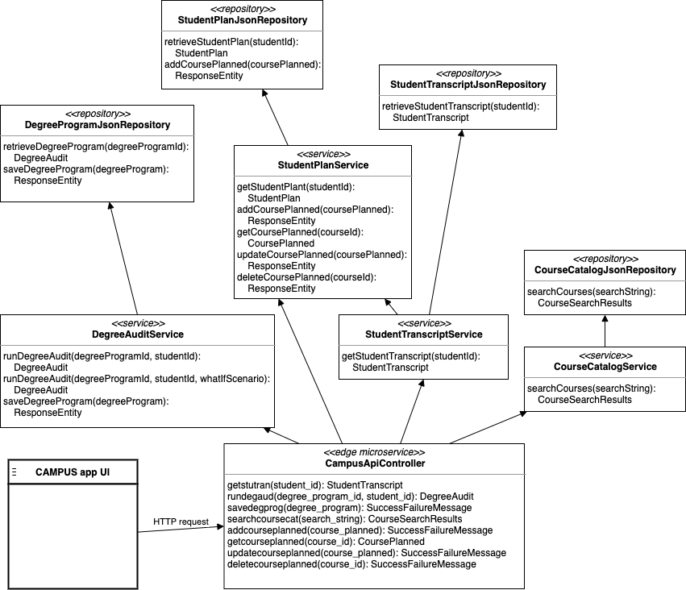

# Campus Degree Audit and Planning System: Technical View


*Note: User interface screenshots shown in this document are of the reference implementation, for illustrative purposes, and are separate from the **Campus Degree Audit and Planning System Microservices***.

## Campus Degree Audit and Planning System (CDAPS) overview

The Campus Degree Audit and Planning System contains a set of microservices and user interfaces that provide the following functionality:

- Creating and maintaining requirements and rules for an educational institution's degree program.
- Comparing a student's academic records to the requirements and rules of a degree program to determine what must still be achieved to earn the degree.
- Planning for upcoming academic terms, recommending courses and providing feedback for optimizing the degree plan.

### Mapping an institution's degree program to a *requirements tree*

The requirements and rules of a degree program are represented in the Campus Degree Audit System by  a *requirements tree*. The left side of the following figure shows a portion of a Computer Science program's requirements from an institution's catalog.  The right side of the figure shows how the Computer Science  program's structure may be mapped to the Campus Degree Audit System requirements tree.


Each element in the requirements tree contains the name of a requirement, as well as the rules for meeting that requirement. For example, the rules for meeting the **Data Structures** requirement are earning 4 credits from course **CIS-221**. This particular requirement is referred to as a *leaf node* in the requirements tree, whereas the **Requirements for CSC Major** requirement is referred to as a *branch node*. The rules for meeting the latter requirement are that the student earn at least 60 credits and achieve a 3.0 grade point average (GPA) from its subordinate requirements. Branch nodes also have an implicit rule: Unless otherwise specified, all of its immediate subordinate requirements must be met. 

### Our *lingua franca* for degree programs

Given that the requirements tree for a degree program is often communicated from an institution to the Campus Degree Audit System, a *lingua franca* (common language) has been defined to represent it. This representation leverages JSON (JavaScript Object Notation), a fragment of which is shown in the following figure.


This JSON document contains *property/value pairs*, with the *property* before a colon, and the *value* after the colon. For example, this JSON document expresses that there is a requirement whose  `name` is `Requirements for CSC Major` and whose rules include `numCreditsRequired` being `60`. In some cases the value is a list of elements, which provides the ability to express that a requirement contains subordinate requirements (`reqs` in the JSON document).

Note: Although classes and methods in the system handle interactions with the JSON document, it is necessary for an institution to know its schema if it is electronically communicating the requirements of a degree program. Please see [Appendix A: JSON schemas](#appendix-a-json-schemas) for details on this schema and its properties, which is referred to as this overview continues.

### Course codes and ranges

Some properties, such as `inCourses`, contain course codes. A course code (e.g. **ENG-101**) consists of a course prefix (e.g. **ENG**) and course number (e.g. **101**), separated by a hyphen. In some properties, course ranges (e.g. **ENG-101:299**) are permitted, which consist of a course prefix and a range of course numbers. The range of course numbers is expressed by a lowest and highest numbers in the range, separated by a colon. To express that a course may have any course prefix, use a single asterisk (e.g. ***-101** and ***-101:299**)

### Representing a student academic record

A student's academic record is represented by a JSON document for the purpose of receiving it electronically from an institution, as well as communicating it to the Campus Degree Audit System microservice responsible for performing a degree audit. Please see the section entitled [StudentTranscript JSON schema](#studenttranscript-json-schema) of Appendix A for details on this schema and its properties.

#### Representing courses taken

There are countless ways that courses taken are presented on student transcripts, but they have a well defined way of being represented by the Campus Degree Audit System:

- Course ID is represented by the format described in the [Course codes and ranges](#course-codes-and-ranges) section.
- Credits earned are represented by a whole number of credits.
- Grade is represented either by traditional letter grades (**A**, **A-**, **B+**, **B**, **B**-, **C+**, **C**, **C-**, **D+**, **D**, **D-**, **F**) or one of the following:
  - **P** for passing a *pass/fail* course
  - **CR** for passing a *credit/no credit* course, optionally including an exam type (e.g. **AP** or **CLEP**).
  - **NC** for not achieving credit in a *credit/no credit* course.
  - **IP** for a course in-progress
  - **W** for a withdrawn course
  - **TR** for a course transferred from another instutition
- Term is represented by a fully spelled season name (**Fall**, **Winter**, **Spring**, **Summer**), and a four digit year (e.g. **2020**).

#### Expressing curriculum pursued

The *majors*, *minors*, *concentrations* and *specializations* that a student is pursuing affect the degree audit process. Please see the section entitled [StudentTranscript JSON schema](#studenttranscript-json-schema) of Appendix A for details on how they are expressed.

#### Overriding requirements for a student

A subset of the rules in any requirement may be overridden for a given student. For example, the number of credits required to complete a Computer Science major could be reduced from 60 to 55. Another example of overriding a rule is to allow a student to take MAT-135 rather than MAT-150 to meet a given requirement. The following rules may be overridden in a requirement:

- Number of credits required
- Number of classes required
- Minimum grade required
- Minimum GPA required
- Number of advanced credits required
- Applicable course codes and ranges
- Excluded course codes and ranges

To override a rule for a given student, an item that expresses the override must exist in the `requirementOverrides` property of the  JSON document that represents the student's academic record. 

### Applying courses to multiple requirements

By default, a course from a student's academic record may only be applied to one requirement during a degree audit. The `scopeTypeAndValue` and `applyToScopes`  properties accommodate policies in which a course may be shared among more than one requirement. 

#### Defining a requirements scope

To identify additional requirements among which courses may be shared, a requirement scope may be defined. This is accomplished by assigning a string to the `scopeTypeAndValue` property, consisting of a scope type, and an optional value, separated by an equal sign. For example, assigning "Minor" to a  `scopeTypeAndValue` property of a requirement expresses that the requirement, and its subordinate requirements, are in a scope with a type named Minor. Assigning "Minor=Marketing" to that property further defines the scope to a Minor named Marketing.

#### Applying courses to a sharing scope

The  `applyToScopes` property is used to indicate that courses in the requirement may be shared with requirement scopes. The `applyToScopes` property contains a list of objects, each of which identifies a requirement scope (`scopeTypeAndValue`) as well as the maximum number of credits (`maxCreditsCounted`) and classes (`maxClassesCounted`) that may be applied to that scope from the requirement.

### Leveraging Spring Expression Language (SpEL)

The requirement and rules of a degree program are often subject to a student's academic record. For example, the number of hours required for a given major may be different if the student is pursuing two majors rather than a single one. For this reason, CDAPS contains a mechanism with which requirements and rules may be adjusted using a student's academic record as input. This is accomplished with the use of the *Spring Expression Language (SpEL)* in conjunction with the `ifExpression`, `metIfExpr` and `numCreditsRequiredExpr` JSON properties.

#### `ifExpression`

The `ifExpression` property in the JSON schema used by the DegreeAuditService contains a logical expression that determines if the requirement will be included in a degree audit. For example, if the desired condition for including a requirement in a degree audit is that the student has more than one major, the following expression could be placed in the `ifExpression` property:

```
numMajors GT 1
```

As indicated previously, the requirement won't appear on the degree audit if the expression evaluates to `false`. If instead you'd like a requirement to appear on the degree audit, but be marked as having been satisfied, you would use the JSON `metIfExpr` property.

#### `metIfExpr`

The `metIfExpr` property in the JSON schema contains a logical expression. When this expression evaluates as `true`, the requirement is forced to be met. The `metIfExpr` expression has no effect if when evaluates as `false`. For example, if a language requirement should be marked as satisfied when a new student has validated it, the following expression could be placed in the `metIfExpr` property:

```
flagsInclude('validateForeignLanguageI')
```

The properties described so far result in a boolean when their expressions are evaluated. The next property evaluates instead into a number, and is used to modify the numeric value of a rule.

#### `numCreditsRequiredExpr`

The `numCreditsRequiredExpr` property in the JSON schema contains a numeric expression that results in the desired number of credits to require. A common usage is a ternary expression that evaluates to one of two values. For example, the following expression could be used to require a different number of credit hours in a requirement for a Music major:

```
majorsInclude('Music') ? 6 : 8
```

The syntax for expressions in all of the properties mentioned previously is fully described in the [Spring Expression Language Reference](https://docs.spring.io/spring/docs/current/spring-framework-reference/core.html#expressions-language-ref). The CDAPS-specific properties and methods that may be used are listed in [Appendix B: Properties and methods available in a SpEL expression](#appendix-b-properties-and-methods-available-in-a-spel-expression).

## Degree audit algorithm overview

Simply stated, the degree audit process compares a student's academic record (discussed in previous sections) with the requirements of a degree program the student is pursuing. This process is currently performed in the following steps, many of which fully traverse the requirements tree. These steps are as follows:

1. Retrieve the degree program and student academic record
2. Apply courses from the academic record to leaf nodes of the requirements tree
3. Remove courses that were applied to multiple leaf node requirements
4. Increment earned credits and classes in leaf node requirements
5. Rollup applied courses and earnings
6. Rollup `met` status, and process `metIfExpr` expressions.
7. Create top-level requirements that hold courses not applied to any requirement
8. Generate academic advice

The following sections describe each of these steps.

#### Step #1: Retrieve the degree program and student's academic record

In this step, JSON documents that express the degree program and student's academic record are retrieved. During this process, any requirements that contain an `ifExpression` rule are omitted from the audit if that expression evaluates false. See the section entitled [If expressions](#if-expressions) for more information. 

#### Step #2: Apply courses from the academic record to leaf nodes of the requirements tree

In this step, courses are applied to leaf nodes in the requirements tree when the following conditions are met:

- The course in the requirement's applicable courses
- The course is not in the requirement's excluded courses
- The course has been completed and passed
- A minimum grade rule, if present, has been satisfied

After applying appropriate courses to leaf node requirements, the audit proceeds to the next step.

#### Step #3: Remove courses that were applied to multiple leaf node requirements

In this step, any course that was applied to multiple requirements is removed if those requirements don't allow sharing that course. See the section entitled [Applying courses to multiple requirements](#applying-courses-to-multiple-requirements) for details on sharing.

If a course has been applied to multiple leaf node requirements that allow sharing it, then courses are removed from requirements based upon constraints expressed in the [Applying courses to multiple requirements](#applying-courses-to-multiple-requirements) section. When a choice is to be made about on which requirements a course should remain, the ones with the least possible course matches (e.g. most restrictive applicable course codes and ranges) are chosen.

#### Step #4: Increment earned credits and classes in leaf node requirements

In this step, the number of earned credits and classes in each applied course are incremented as allowed by the rules in each leaf node requirement. Specifically:

- The requirement's `numCreditsEarned` is incremented by the number of credits in the course, unless the requirement has a `maxCreditsCounted` or `maxDisciplines` rule that would be exceeded (in which case the course is removed from the requirement). Please see the section entitled [JSON properties used to express a degree program](#json-properties-used-to-express-a-degree-program) of Appendix A for details on this and other rules mentioned.
- The requirement's `numClassesEarned` is incremented by 1, unless the requirement has a `maxClassesCounted` rule that would be exceeded (in which case the course is removed from the requirement).
- If the requirement has the `maxTermCreditsCounted` rule, then remove the course from the requirement if it would be exceeded in any term when adding the credits for the course. If the requirement has the `maxTermClassesCounted` rule, then remove the course from the requirement if it would be exceeded in any term when adding 1 for the course.
- If the course is advanced, the requirement's `numAdvCreditsEarned` is incremented by the number of credits in the course.
- If the course was taken in-residence, the requirement's `numResCreditsEarned` is incremented by the number of credits in the course, and the requirement's `numResClassesEarned` is incremented by 1.
- Calculate the grade point average of courses that remain on the requirement, excluding courses that are transferred, and courses that are graded pass/fail.
- Mark the requirement as having been `met` if criteria for `numCreditsRequired`, `numAdvCreditsRequired`, `numClassesRequired`, `minDisciplines`, `numResCreditsRequired`, `numResClassesRequired`, `gpaRequired` , `numTermCreditsRequired`  and `numTermClassesRequired` are satisfied.

Now that the leaf node requirements have been populated, earning will be rolled up in the next step.

#### Step #5: Rollup applied courses and earnings

In this step, every non-leaf node requirement is visited, rolling up applied courses and earnings from its subordinate requirements, as allowed by the rules in each non-leaf node (referred to as parent node in the following bullets) requirement. Specifically:

- If a course applied to a subordinate requirement doesn't meet the `minGradeRequired`, don't apply the course to the parent node requirement.
- The parent node requirement's `numCreditsEarned` is incremented by the number of credits in the course, unless the requirement has a `maxCreditsCounted` rule that would be exceeded (in which case the course is not applied to the parent node requirement). Please see the section entitled [JSON properties used to express a degree program](#json-properties-used-to-express-a-degree-program) of Appendix A for details on this and other rules mentioned.
- The parent node requirement's `numClassesEarned` is incremented by 1, unless the requirement has a `maxClassesCounted` rule that would be exceeded (in which case the course is not applied to the  parent node requirement).
- If the parent node requirement has the `maxTermCreditsCounted` rule, then don't apply the course to the parent node requirement if it would be exceeded in any term when adding the credits for the course. If the requirement has the `maxTermClassesCounted` rule, then don't apply the course to the parent node requirement if it would be exceeded in any term when adding 1 for the course.
- If the course is advanced, the parent node requirement's `numAdvCreditsEarned` is incremented by the number of credits in the course.
- If the course is in-residence, the parent node requirement's `numResCreditsEarned` is incremented by the number of credits in the course, and the parent node requirement's `numResClassesEarned` is incremented by 1.
- Calculate the grade point average of courses that remain on the parent node requirement, excluding courses that are transferred, and courses that are graded pass/fail.

Now that the rest of the requirements tree has been populated, the `met` status of all the requirements in the tree will be rolled up and computed.

#### Step #6: Rollup `met` status, and process `metIfExpr` expressions.

In this step, every non-leaf node (referred to as parent node in the following bullets) requirement is visited, rolling up the `met` status from its subordinate requirements. Specifically:

- Mark the parent node requirement as `met` if all of its subordinate requirements are `met`, or the if the parent node `orGate` rule is true. Please see the section entitled [JSON properties used to express a degree program](#json-properties-used-to-express-a-degree-program) of Appendix A for details on this and other rules mentioned.
- Change the requirement to not `met` if any of the criteria for `numCreditsRequired`, `numAdvCreditsRequired`, `numClassesRequired`, `numResCreditsRequired`, `numResClassesRequired`, `gpaRequired` , `numTermCreditsRequired`  and `numTermClassesRequired` are not satisfied.

Also in this step, the completion percent for each requirement is calculated. This enables progress bars, as shown in the following screenshot, to display the student's progress toward high-level requirements such as majors, minors and general education.


Now that the rules have been processed at every level of the requirements tree, the courses that weren't applied will be added to additional top-level requirements.

#### Step #7: Create top-level requirements that hold courses not applied to any requirement

In this step, three top-level requirements are created to hold courses that couldn't be applied to any other requirements. These top-level requirements are: **In-progress**, **Insufficient** and **Additional Courses**.

- The **In-progress** requirement is populated with courses that are denoted as such in the academic record. Their numbers of credits, advanced credits, and classes are incremented.
- The **Insufficient** requirement is populated with courses that were failed, withdrawn, no credit received, or the `minGradeRequired` wasn't achieved. Their numbers of credits, advanced credits, and classes are incremented.
- The **Additional Courses** requirement is populated with any remaining courses that weren't applied to any other requirement. Their numbers of credits, advanced credits, and classes are incremented. If appropriate, their GPA is calculated.

Now that all of the courses have been applied to at least one requirement, academic advice will be generated.

#### Step #8: Generate academic advice

During the audit process, academic advice is generated and displayed. The currently generated advice includes expressing what is still needed for individual requirements in the tree, as well as suggesting a next course to take.

##### Advice that expresses what is still needed for individual requirements

The following (reference implementation) **Degree Audit** screen contains a couple of examples of **still needed** advice, highlighted by arrows.


Referring to this screenshot:

- The **Required core courses** requirement contains a rule specifying that 38 credits are required. Given that the student earned 37 credits, the advice generated is **Still needed: 1 more credit**. 
- The **Requirements for CSC Major** requirement contains rules specifying that 60 credits, and a grade point average of at least 3.0, are required. A calculation is performed that takes both rules into consideration, generating advice that states **Still needed: 17 more credits. GPA is currently 2.84, so you need to achieve a 3.37 GPA in the 17 remaining credits.**

Advice may be generated for requirements that contain one or more of the following rules:

- Number of credits required
- Number of credits required in residence
- Number of advanced credits required
- Number of classes required
- Number of classes in residence required
- Minimum GPA required

Advice is not generated for any `met` requirement (signified by a checkmark in the screenshot), nor is advice generated for any requirement that has a `met` ancestor requirement. 

##### Advice that suggests a next course to take

Another type of generated advice suggests a next course for the student to take, based upon prerequisites of courses required by the degree audit. To illustrate, the following table contains a row for any course that has prerequisites, applicable to a given degree audit.


These courses and prerequisites define directed acyclic graphs (DAG) that express paths of dependencies between courses. For example, one such path from a course to its most distance dependency is the following: 

`CIS-363 -> CIS-221 -> CIS-126 -> CIS-125`

If all of the courses in the path are required by the degree audit, taking CIS-125 unlocks the ability for student to take CIS-126, etc.

To generate this type of advice, the system analyzes every path in every DAG and determines which course to suggest that the student take next, based upon how many required (but not yet taken) courses in various paths are dependent upon it. The resultant advice is added to any other advice in the requirement at the top of the degree audit, as shown in the following screenshot.


The advice in this case is: **Consider taking CIS-125 soon, as it is a prerequisite for other required courses in your curriculum.**

Please see the section entitled [JSON properties used to express a degree program](#json-properties-used-to-express-a-degree-program) of Appendix A for details on how the course prerequisites are expressed in JSON.

## Running "what-if" scenarios

CDAPS leverages a student's academic program such as declared majors, as well as chosen minors, concentrations and specializations, when running a degree audit. Occasionally a student or advisor would like to see how making changes in their program would affect remaining credits required, completion dates or other factors. The "what-if scenario" functionality exists in CDAPS for these occasions, as shown in the following reference implementation screenshots.


In this dialog box, users may choose a first, second and third major, minors, concentrations and specializations. They may also choose flags that a degree audit uses when evaluating requirements and associated rules. When clicking the **Run What-if** button, CDAPS uses these choices rather than ones found in the student's academic program. These choices are supplied to the CDAPS microservices as arguments appended to the URL. For example, the choices in the previous dialog box would result in the following to be appended to the `rundegaud` URL discussed in [Microservices Overview](#microservices-overview).

`&majors=Theatre BS,DesignForSocialImpact BA`

`&minors=Mathematics`

`&concentrations=TheatreTechnicalConcentration`

`&flags=exemptSixHoursForeignLanguage`

These are then marshaled into a `WhatIfScenario` instance which is supplied as an argument to the overloaded `runDegreeAudit` method of `DegreeAuditService` shown in the Microservices Overview.

## Degree Planning subsystem

CDAPS includes a Degree Planning subsystem that provides academic planning tools for students and their advisors. One such tool is located in the **Degree Plan** tab of the reference UI, and contains academic terms relevant to the student's degree program. Within these academic term containers are entries for courses the student has taken, is taking, or is planning to take. When a degree audit is run, courses in the student's academic record appear in the corresponding academic term container (whose academic term year and season match). 

- Some of these courses may correspond to academic terms occurring prior to the current academic term. It is expected that such courses would never be notated as **IP** (In-progress) on the student's academic record, but rather have some other sort of grade indicating completion.
- Some of these courses may correspond to the current academic term. The system is aware of the student's current academic term, as it is supplied as a part of the academic record. The UI should have some indication of which container represents the current academic term.
- Some of these courses may correspond to a future academic term. 
  - Such courses would be stored in a CDAPS database. Please see the section entitled  [StudentPlan JSON schema](#studentplan-json-schema)  of Appendix A for a minimal implementation of representing a student's planned courses.
  - Such courses would always be notated as **PL** (planned) when injected into the student's academic record when degree audit is run, indicating that the course is planned.
  - These courses may be associated with a term, but don't have to be.


In addition to holding courses from the student's academic record, academic term containers that represent future terms may hold courses that the system suggests that the student take. For example:

- Courses required by the degree program (requirement specifies a single course, and no ancestor contains an **OR gate** requirement) for which the student hasn't yet registered will appear in academic term container where they best fit. These are placed in the following manner:
  - Courses that have prerequisites are placed first, beginning with the courses that have the longest chain of prerequisites not yet taken. These courses are placed in the earliest (closest to the current) academic term containers possible, while respecting prerequisite dependencies.
  - Courses that don't have prerequisites are placed next, in the earliest (closest to the current) academic term containers possible. If a course exceeds the credit limit of an academic term container, it is added instead to the next academic term, adding an academic term if necessary.
- Remaining requirements (but only including one subordinate branch of **OR gate** requirements) are then represented in appropriate academic term containers. Each contains course codes/ranges, number of credits/classes required, and requirement name.

### Specifying hours per upcoming academic term

Institutions as well as students have various expectations for minimum/maximum hours per upcoming academic term. To support these expectations:

- An institution may specify per degree program the minimum and maximum number of hours per academic term season, e.g. Spring 2030, that a full time student must take. By default, the degree planning process described previously uses these hours when populating academic terms.
- A student may specify a minimum and maximum number of hours per upcoming academic term season. The degree planning process uses these values, provided they are between the minimum/maximum hours set by the institution for the associated academic terms.

Please see sections entitled [JSON properties used to express a degree program](#json-properties-used-to-express-a-degree-program) and [StudentPlan JSON schema](#studentplan-json-schema) of Appendix A for details on how these minimum and maximum hours are expressed in JSON.

## Microservices Overview 

The business logic of CDAPS is implemented in *microservices* comprised of the classes shown in the following diagram. All CDAPS functionality is exposed via a set of HTTP endpoints known as *edge services*, implemented by the `CampusApiController` class.





A given user interface, such as the reference UI shown in this document, accesses these CDAPS microservices via HTTP GET and POST requests. For example, the majority of CDAPS functionality is implemented in the `runDegreeAudit` microservice, accessible by calling the `rundegaud` endpoint as shown in the following code example:

`http://127.0.0.1:8080/rundegaud?degree_program_id=COL_ARTS_SCI&student_id=ID007`

As a result of this call, the specified degree program and student's academic records are retrieved, and a degree audit is performed. A JSON document is returned that expresses the student's degree audit as specified in the [DegreeAudit JSON schema](#degreeaudit-json-schema) section in Appendix A.

Each of the services (e.g. **DegreeAuditService** and **StudentTranscriptService**) in the previous diagram leverage repositories (e.g. **DegreeProgramJsonRepository** and **StudentTranscriptJsonRepository**) that contain relevant data or access external services. Integrating with new databases and external systems involves replacing or updating these repository classes. 

## Appendix A: JSON schemas

This system's microservices consume and produce data expressed in JSON (JavaScript Object Notation) documents, namely [DegreeAudit](#degreeaudit-json-schema), [StudentTranscript](#studenttranscript-json-schema), [StudentPlan](#studentplan-json-schema)  and [CourseCatalog](#coursecatalog-json-schema). The following sections specify the schemas of these documents.

### DegreeAudit JSON schema 

The following two tables describe the **DegreeAudit** JSON properties. The first table contains only the properties required to express a degree program. The second table contains the additional properties required to hold values that are computed in the process of running a degree audit.

#### JSON properties used to express a degree program

| Name                     | Type            | Description                                                  | Human readable name                                 | Notes                                                        |
| ------------------------ | --------------- | ------------------------------------------------------------ | --------------------------------------------------- | ------------------------------------------------------------ |
| `degreeProgramId`        | string          | ID for the degree program                                    | Degree program ID                                   | **Required**. *Occurs only once in the JSON document, namely at the root.* |
| `virtualDisciplines`     | list of objects | Contains list of objects, each of which contains properties `disciplineName` and `coursePrefixes`, that enable more than one course prefix to share the same discipline. The `minDisciplines` and `maxDisciplines` rules are affected by this property. | Virtual disciplines                                 | **Optional**. *Occurs only once in the JSON document, namely at the root.* |
| `coursePrereqs`          | list of objects | Contains list of objects, each of which contains properties `courseId` and `prereqs`, that express the prerequisites for a course. See the section entitled [Advice that suggests a next course to take](#advice-that-suggests-a-next-course-to-take). | Course prerequisites                                | **Optional**. *Occurs only once in the JSON document, namely at the root.* |
| `reusableCourses`        | list            | A list of course codes (or ranges) that may applied to a degree program multiple times during a degree audit, once for each time that a course appears on a student's transcript. | Reusable courses                                    | **Optional**. By default, a course listed on a student transcript may only be applied once. *Occurs only once in the JSON document, namely at the root.* |
| `planTermConstraints`    | list of objects | Contains list of objects, each of which contains properties `termSeason`, `termYear`, `minTermPlanCredits` and `maxTermPlanCredits`, that express constraints imposed on an upcoming academic term. See the section entitled [Specifying hours per upcoming academic term](#specifying-hours-per-upcoming-academic-term). | Student plan term constraints                       | **Optional**. *Occurs only once in the JSON document, namely at the root.* |
| `divisionsPrograms`      | list of objects | Contains list of objects, each of which contains properties `division` , `majors`, `majors`, `specializations` and `certificates` that express the relationships between a division and its programs. | Divisions and their programs                        | **Optional**. *Occurs only once in the JSON document, namely at the root.* |
| `name`                   | string          | The name of a requirement (or degree program if at the root of the tree) | Requirement name                                    | **Required**. *Must occur in the root of the JSON document, and in each  requirement.* |
| `description`            | string          | The description of a requirement                             | Requirement description                             | **Optional**.                                                |
| `numCreditsRequired`     | integer         | Minimum number of credits needed to meet the requirement.    | Number of credits required                          | **Optional**.                                                |
| `maxCreditsCounted`      | integer         | Maximum number of credits that may be applied toward meeting the requirement. | Max number of credits counted.                      | **Optional**.                                                |
| `numClassesRequired`     | integer         | Minimum number of classes needed to meet the requirement.    | Number of classes required                          | **Optional**.                                                |
| `maxClassesCounted`      | integer         | Maximum number of classes that may be applied toward meeting the requirement. | Max number of classes counted                       | **Optional**.                                                |
| `minGradeRequired`       | decimal         | Minimum numeric grade required for a course to be applied to the requirement. | Minimum grade required                              | **Optional**. *May occur in any  requirement in the JSON document.* |
| `gpaRequired`            | decimal         | Minimum grade point average (GPA) needed in the courses applied to the requirement. | Minimum GPA required                                | **Optional**.                                                |
| `numAdvCreditsRequired`  | integer         | Minimum number of credits in advanced (e.g. 300+) level course needed to meet the requirement. | Number of advanced credits required                 | **Optional**.                                                |
| `numTermCreditsRequired` | integer         | Minimum number of credits per term needed to meet the requirement. | Number of credits required per term                 | **Optional**.                                                |
| `maxTermCreditsCounted`  | integer         | Maximum number of credits that may be applied per term toward meeting the requirement. | Max number of credits counted per term              | **Optional**.                                                |
| `numTermClassesRequired` | integer         | Minimum number of classes per term needed to meet the requirement. | Number of classes required per term                 | **Optional**.                                                |
| `maxTermClassesCounted`  | integer         | Maximum number of classes that may be applied per term toward meeting the requirement. | Max number of classes counted per term              | **Optional**.                                                |
| `numResCreditsRequired`  | integer         | Minimum number of credits in residence needed to meet the requirement. | Number of credits required in residence             | **Optional**.                                                |
| `numResClassesRequired`  | integer         | Minimum number of classes in residence needed to meet the requirement. | Number of classes required in residence             | **Optional**.                                                |
| `scopeTypeAndValue`      | string          | Optional audit scope type of the requirement, and an optional value, separated by an equal sign, e.g. Concentration=Biochemistry. See the section entitled [Applying courses to multiple requirements](#applying-courses-to-multiple-requirements). | Scope type and value                                | **Optional**.                                                |
| `orGate`                 | boolean         | If `true`, only one of the immediate subordinate requirements must be met before this requirement may be met. | Operator for child requirements (AND/OR)            | **Optional**. Defaults to "AND", in which all immediate subordinate requirements must be met before this requirement may be met. |
| `reqs`                   | list of objects | Contains list of subordinate requirement objects.            | Subordinate requirements                            | **Required**. *Must occur in the root of the JSON document, but is optional in any  requirement.* |
| `applyToScopes`          | list of objects | Contains list of objects, each of which contains properties `scopeTypeAndValue`, `maxCreditsCounted` and `maxClassesCounted`, that express a scope and limits for sharing courses applied. See the section entitled [Applying courses to multiple requirements](#applying-courses-to-multiple-requirements). | Scopes and credits/classes limits to apply courses. | **Optional**. *May occur in any  requirement in the JSON document.* |
| `ifExpression`           | string          | A logical SpEL expression that determines whether the requirement will be included in a degree audit. See the section entitled [`ifExpression`](#ifexpression). | If expression                                       | **Optional**. *May occur in any  requirement in the JSON document.* |
| `metIfExpr`              | string          | A logical SpEL expression that forces a requirement to be met if the expression is true. Has no effect if the expression is false. See the section entitled [`metIfExpr`](#metIfExpr). | Met if expression                                   | **Optional**. *May occur in any  requirement in the JSON document.* |
| `numCreditsRequiredExpr` | string          | A SpEL expression that determines the minimum number of credits required for a requirement in a degree audit. See the section entitled [`numCreditsRequiredExpr`](#numCreditsRequiredExpr). | Number of credits required expression               | **Optional**. *May occur in any  requirement in the JSON document.* |
| `minDisciplines`         | integer         | Minimum number of unique disciplines (course prefixes) that must be present in the applied courses to meet the requirement. | Minimum number of disciplines                       | **Optional**. *May occur in any leaf-node requirement in the JSON document.* |
| `maxDisciplines`         | integer         | Maximum number of unique disciplines (course prefixes) that may be present in the applied courses to meet the requirement. | Maximum number of disciplines                       | **Optional**. *May occur in any leaf-node requirement in the JSON document.* |
| `inCourses`              | list of strings | A list of course codes (and ranges) applicable to the requirement. See the section entitled [Course codes and ranges](#course-codes-and-ranges). | List of applicable courses                          | **Optional**. *May occur in any leaf-node requirement in the JSON document.* |
| `exceptCourses`          | list of strings | A list of course codes (and ranges) that are not applicable to the requirement. See the section entitled [Course codes and ranges](#course-codes-and-ranges). | List of excluded courses                            | **Optional**. *May occur in any  leaf-node requirement in the JSON document.* |

#### JSON properties added during a degree audit

| Name                           | Type             | Description                                                  | Human readable name                    | Notes         |
| ------------------------------ | ---------------- | ------------------------------------------------------------ | -------------------------------------- | ------------- |
| `met`                          | boolean          | Indication of whether requirement was met during the audit.  | Requirement met                        | **Computed**. |
| `numCreditsEarned`             | integer          | Number of credits earned for the requirement.                | Number of credits earned               | **Computed**. |
| `numAdvCreditsEarned`          | integer          | Number of advanced credits earned for the requirement.       | Number of advanced credits earned      | **Computed**. |
| `numClassesEarned`             | integer          | Number of classes earned for the requirement.                | Number of classes earned               | **Computed**  |
| `gpaEarned`                    | decimal          | Grade point average (GPA) earned for the requirement.        | GPA earned                             | **Computed**  |
| `gradePointsEarned`            | integer          | Number of grade points earned for the requirement. Used for calculating GPA. | N/A                                    | **Computed**  |
| `gpaCreditsEarned`             | decimal          | Number of GPA credits earned for the requirement. Used for calculating GPA. | N/A                                    | **Computed**  |
| `classesApplied`               | array of objects | Classes applied to the requirement from the student's academic record during the audit. | Classes taken for this requirement     | **Computed**  |
| `numResCreditsEarned`          | integer          | Number of credits earned in residence for the requirement.   | Number of credits earned in residence  | **Computed**. |
| `numResClassesEarned`          | integer          | Number of classes earned in residence for the requirement.   | Number of classes earned in residence  | **Computed**. |
| `studentAdvice`                | string           | Advice for the student pertaining to the requirement, often expressed as "still needed". | Student advice                         | **Computed**  |
| `reqBeforeOverride`            | object           | In the case that a requirement is overridden, this property contains overridable rules from the original requirement. See section entitled [Overriding requirements for a student](#overriding-requirements-for-a-student) | Original requirement before overridden | **Computed**  |
| `generated`                    | boolean          | Indication that a requirement was generated during the audit. Requirements such as **Additional Courses**, **Insufficient** and **In-progress** are generated during an audit to hold courses that aren't applied to any other requirement. | N/A                                    | **Computed**. |
| `requirementCompletionPercent` | integer          | Completed percentage of the requirement by the student. Pertains to top-level DegreeAudit requirement as well as subordinate requirements. | Percent complete                       | **Required**. |
| `degreePlan`                   | object           | Contains a `termPlans` objects.                              | Degree plan                            | **Required**. |
| `termPlans`                    | list of objects  | Contains list of objects, each of which contains properties `termSeason`, `termYear` and `planCourses`, that express the student's degree plan. This list of object is ordered chronologically by academic term, with no terms skipped even when the `planCourses` for that term is empty. | Planned academic terms                 | **Required**. |
| `planCourses`                  | list of objects  | Contains list of courses pertaining to an academic term on the student's degree plan, each of which contains properties `courseId`, `courseName`, `numCredits`, `numClasses`, and `grade`. | Plan courses                           | **Required**. |
| `whatIfScenarioOptions`        | object           | What-if scenario options. Object  that contains properties `majors`, `minors`, `concentrations`,  `specializations` and `flags`. | What-if scenario options               | **Required**. |

#### DegreeAudit formal JSON schema

The following contains the formal JSON schema for the DegreeAudit JSON document. See [JSON Schema article on Wikipedia](https://en.wikipedia.org/wiki/JSON#JSON_Schema).

```json
{
  "$schema": "http://json-schema.org/draft/2019-09/schema",
  "title": "DegreeAudit",
  "type": "object",
  "required": [
    "degreeProgramId",
    "name",
    "reqs"
  ],
  "properties": {
    "degreeProgramId": {
      "type": "string",
      "description": "ID for the degree program"
    },
    "virtualDisciplines": {
      "type": "array",
      "description": "Relates one or more course prefixes to a discipline.",
      "items": {
        "type": "object",
        "required": [
          "disciplineName",
          "coursePrefixes"
        ],
        "properties": {
          "disciplineName": {
            "type": "string",
            "description": "Virtual discipline name."
          },
          "coursePrefixes": {
            "type": "array",
            "items": {
              "type": "string",
              "description": "A list of course prefixes pertaining to the discipline."
            }
          }
        }
      }
    },
    "coursePrereqs": {
      "type": "array",
      "description": "Contains list of objects that express prerequisites for courses.",
      "items": {
        "type": "object",
        "required": [
          "courseId",
          "prereqs"
        ],
        "properties": {
          "courseId": {
            "type": "string",
            "description": "ID of a course that has prerequisites."
          },
          "prereqs": {
            "type": "array",
            "items": {
              "type": "string",
              "description": "A list of prerequisite course IDs."
            }
          }
        }
      }
    },
    "reusableCourses": {
      "type": "array",
      "description": "A list of course codes (or ranges) that may applied to a degree program multiple times during a degree audit, once for each time that a course appears on a student's transcript."
    },
    "planTermConstraints": {
      "type": "array",
      "description": "Contains list of constraints imposed on an upcoming academic term. ",
      "items": {
        "type": "object",
        "required": [
          "termSeason",
          "termYear"
        ],
        "properties": {
          "termSeason": {
            "type": "string",
            "description": "Season of term to which a constraint applies (e.g. 'Fall' and 'Spring')"
          },
          "termYear": {
            "type": "number",
            "description": "Year of term to which a constraint applies",
            "minimum": 1900
          }
          "minTermPlanCredits": {
            "type": "number",
            "description": "Preferred minimum number of credits for planned term",
            "minimum": 0
          },
          "maxTermPlanCredits": {
            "type": "number",
            "description": "Preferred maximum number of credits for planned term",
            "minimum": 0
          }
        }
      }
    },
    "name": {
      "type": "string",
      "description": "The name of a requirement (or degree program if at the root of the tree)"
    },
    "description": {
      "type": "string",
      "description": "The description of a requirement"
    },
    "numCreditsRequired": {
      "type": "number",
      "description": "Minimum number of credits needed to meet the requirement.",
      "minimum": 0
    },
    "numCreditsRequiredExpr": {
      "type": "string",
      "description": "A SpEL expression that determines the minimum number of credits required for a requirement in a degree audit."
    },
    "maxCreditsCounted": {
      "type": "number",
      "description": "Maximum number of credits that may be applied toward meeting the requirement.",
      "minimum": 0
    },
    "numClassesRequired": {
      "type": "number",
      "description": "Minimum number of classes needed to meet the requirement.",
      "minimum": 0
    },
    "maxClassesCounted": {
      "type": "number",
      "description": "Maximum number of classes that may be applied toward meeting the requirement.",
      "minimum": 0
    },
    "minGradeRequired": {
      "type": "number",
      "description": "Minimum numeric grade required for a course to be applied to the requirement.",
      "minimum": 0
    },
    "gpaRequired": {
      "type": "number",
      "description": "Minimum grade point average (GPA) needed in the courses applied to the requirement.",
      "minimum": 0
    },
    "numAdvCreditsRequired": {
      "type": "number",
      "description": "Minimum number of credits in advanced (e.g. 300+) level course needed to meet the requirement.",
      "minimum": 0
    },
    "numTermCreditsRequired": {
      "type": "number",
      "description": "Minimum number of credits per term needed to meet the requirement.",
      "minimum": 0
    },
    "maxTermCreditsCounted": {
      "type": "number",
      "description": "Maximum number of credits that may be applied per term toward meeting the requirement.",
      "minimum": 0
    },
    "numTermClassesRequired": {
      "type": "number",
      "description": "Minimum number of classes per term needed to meet the requirement.",
      "minimum": 0
    },
    "maxTermClassesCounted": {
      "type": "number",
      "description": "Maximum number of classes that may be applied per term toward meeting the requirement.",
      "minimum": 0
    },
    "numResCreditsRequired": {
      "type": "number",
      "description": "Minimum number of credits in residence needed to meet the requirement.",
      "minimum": 0
    },
    "numResClassesRequired": {
      "type": "number",
      "description": "Minimum number of classes in residence needed to meet the requirement.",
      "minimum": 0
    },
    "scopeTypeAndValue": {
      "type": "string",
      "description": "Optional audit scope type of the requirement, and an optional value, separated by an equal sign, e.g. Concentration=Biochemistry"
    },
    "orGate": {
      "type": "boolean",
      "description": "If true, only one of the immediate subordinate requirements must be met before this requirement may be met."
    },
    "reqs": {
      "type": "array",
      "description": "Contains list of subordinate requirement objects.",
      "items": {
        "type": "object",
        "description": "Object whose properties contains rules for the requirement. Note that most of these rules are also defined at the top level of the DegreeAudit object, which is where their details may be referenced.",
        "required": [
          "name"
        ],
        "properties": {
          "name": {},
          "description": {},
          "numCreditsRequired": {},
          "maxCreditsCounted": {},
          "numClassesRequired": {},
          "maxClassesCounted": {},
          "minGradeRequired": {},
          "gpaRequired": {},
          "numAdvCreditsRequired": {},
          "numTermCreditsRequired": {},
          "maxTermCreditsCounted": {},
          "numTermClassesRequired": {},
          "maxTermClassesCounted": {},
          "numResCreditsRequired": {},
          "numResClassesRequired": {},
          "scopeTypeAndValue": {},
          "orGate": {},
          "reqs": {},
          "applyToScopes": {
            "type": "array",
            "description": "Contains list of objects that express a scope and limits for sharing courses applied.",
            "items": {
              "type": "object",
              "required": [
                "scopeTypeAndValue"
              ],
              "properties": {
                "scopeTypeAndValue": {
                  "type": "string",
                  "description": "Scope for sharing courses."
                },
                "maxCreditsCounted": {
                  "type": "number",
                  "description": "Maximum number of credits that may be applied to the shared scope (-1 expresses that there is no limit).",
                  "minimum": -1
                },
                "maxClassesCounted": {
                  "type": "number",
                  "description": "Maximum number of classes that may be applied to the shared scope (-1 expresses that there is no limit).",
                  "minimum": -1
                }
              }
            }
          },
          "ifExpression": {
            "type": "string",
            "description": "A logical SpEL expression that determines whether the requirement will be included in a degree audit."
          },
          "metIfExpr": {
            "type": "string",
            "description": "A logical SpEL expression that forces a requirement to be met if the expression is true. Has no effect if the expression is false."
          },
          "minDisciplines": {
            "type": "number",
            "description": "Minimum number of unique disciplines (course prefixes) that must be present in the applied courses to meet the requirement.",
            "minimum": 0
          },
          "maxDisciplines": {
            "type": "number",
            "description": "Maximum number of unique disciplines (course prefixes) that may be present in the applied courses to meet the requirement.",
            "minimum": 0
          },
          "inCourses": {
            "type": "array",
            "items": {
              "type": "string",
              "description": "A list of course codes (and ranges) applicable to the requirement."
            }
          },
          "exceptCourses": {
            "type": "array",
            "items": {
              "type": "string",
              "description": "A list of course codes (and ranges) that are not applicable to the requirement."
            }
          },
          "met": {},
          "numCreditsEarned": {},
          "numAdvCreditsEarned": {},
          "numClassesEarned": {},
          "gpaEarned": {},
          "gradePointsEarned": {},
          "gpaCreditsEarned": {},
          "classesApplied": {},
          "numResCreditsEarned": {},
          "numResClassesEarned": {},
          "studentAdvice": {},
          "reqBeforeOverride": {},
          "generated": {
            "type": "boolean",
            "description": "Indication that a requirement was generated during the audit."
          }
        }
      }
    },
    "met": {
      "type": "boolean",
      "description": "Indication of whether requirement was met during the audit."
    },
    "numCreditsEarned": {
      "type": "number",
      "description": "Number of credits earned for the requirement.",
      "minimum": 0
    },
    "numAdvCreditsEarned": {
      "type": "number",
      "description": "Number of advanced credits earned for the requirement.",
      "minimum": 0
    },
    "numClassesEarned": {
      "type": "number",
      "description": "Number of classes earned for the requirement.",
      "minimum": 0
    },
    "gpaEarned": {
      "type": "number",
      "description": "Grade point average (GPA) earned for the requirement.",
      "minimum": 0
    },
    "gradePointsEarned": {
      "type": "number",
      "description": "Number of grade points earned for the requirement. Used for calculating GPA.",
      "minimum": 0
    },
    "gpaCreditsEarned": {
      "type": "number",
      "description": "Number of GPA credits earned for the requirement. Used for calculating GPA.",
      "minimum": 0
    },
    "classesApplied": {
      "type": "array",
      "description": "Classes applied to the requirement from the student's academic record during the audit.",
      "items": {
        "type": "object",
        "required": [
          "courseId",
          "numCredits",
          "grade"
        ],
        "properties": {
          "courseId": {
            "type": "string",
            "description": "Course code of the applied class"
          },
          "numCredits": {
            "type": "number",
            "description": "Number of credits applied",
            "minimum": 0
          },
          "grade": {
            "type": "string",
            "description": "Letter grade achieved (e.g. 'A', 'CR' and 'IP')"
          },
          "examType": {
            "type": "string",
            "description": "Type of exam (e.g. 'AP' and 'CLEP')"
          },
          "termSeason": {
            "type": "string",
            "description": "Season of term that class was taken (e.g. 'Fall' and 'Spring')"
          },
          "termYear": {
            "type": "number",
            "description": "Year of term that class was taken",
            "minimum": 1900
          }
        }
      }
    },
    "numResCreditsEarned": {
      "type": "number",
      "description": "Number of credits earned in residence for the requirement.",
      "minimum": 0
    },
    "numResClassesEarned": {
      "type": "number",
      "description": "Number of classes earned in residence for the requirement.",
      "minimum": 0
    },
    "studentAdvice": {
      "type": "string",
      "description": "Advice for the student pertaining to the requirement"
    },
    "reqBeforeOverride": {
      "type": "object",
      "description": "In the case that a requirement is overridden, this property contains overridable rules from the original requirement",
      "required": [
        "name"
      ],
      "properties": {
        "name": {},
        "numCreditsRequired": {},
        "numClassesRequired": {},
        "minGradeRequired": {},
        "gpaRequired": {},
        "numAdvCreditsRequired": {},
        "inCourses": {},
        "exceptCourses": {}
      }
    },
    "degreePlan": {
      "type": "object",
      "description": "Contains a termPlans object.",
      "required": [
        "name"
      ],
      "properties": {
        "termPlans": {
          "type": "array",
          "items": {
            "type": "object",
            "properties": {
              "termSeason": {},
              "termYear": {},
              "planCourses": {
                "type": "array",
                "items": {
                  "type": "object",
                  "description": "A planned course"
                  "properties": {
                    "courseId": {},
                    "courseName": {},
                    "numCredits": {},
                    "numClasses": {},
                    "grade": {},
                  }
                }
              }
            }
          }
        }
      }
    },
    "whatIfScenarioOptions": {
      "type": "object",
      "description": "What-if scenario options to explore.",
      "required": [],
      "properties": {
        "majors": {
          "type": "array",
          "items": {
            "type": "string",
            "description": "A list of majors to model in a what-if scenario."
          }
        },
        "minors": {
          "type": "array",
          "items": {
            "type": "string",
            "description": "A list of minors to model in a what-if scenario."
          }
        },
        "concentrations": {
          "type": "array",
          "items": {
            "type": "string",
            "description": "A list of concentrations to model in a what-if scenario."
          }
        },
        "specializations": {
          "type": "array",
          "items": {
            "type": "string",
            "description": "A list of specializations to model in a what-if scenario."
          }
        },
        "flags": {
          "type": "array",
          "items": {
            "type": "string",
            "description": "A list of flags relevant to the degree audit to model in a what-if scenario."
          }
        }
      }
    }
  }
}
```

####  

### StudentTranscript JSON schema 

| Name                   | Type            | Description                                                  | Human readable name          | Notes                                                        |
| ---------------------- | --------------- | ------------------------------------------------------------ | ---------------------------- | ------------------------------------------------------------ |
| `studentId`            | string          | Alphanumeric identifier for the student.                     | Student ID                   | **Required**.                                                |
| `firstName`            | string          | Student's first name.                                        | First name                   | **Required**.                                                |
| `lastName`             | string          | Student's last name, or surname.                             | Last name                    | **Required**.                                                |
| `coursesTaken`         | list of objects | Contains list of classes taken, each of which contains properties `courseId`, `numCredits`, `grade`, `examType`, `termSeason` and `termYear`. See the section entitled [Representing a student academic record](#representing-a-student-academic-record). | Courses taken                | **Required**.                                                |
| `curriculum`           | object          | Curriculum the student is pursuing. Object  that contains properties `majors`, `minors`, `concentrations`,  `specializations` and `flags`. | Curriculum                   | **Optional**.                                                |
| `majors`               | list of strings | Contain a list of majors that the student is pursuing.       | Majors                       | **Optional**.  *Occurs only in the curriculum property.*     |
| `minors`               | list of strings | Contain a list of minors that the student is pursuing.       | Minors                       | **Optional**. *Occurs only in the curriculum property.*      |
| `concentrations`       | list of strings | Contain a list of concentrations that the student is pursuing. | Concentrations               | **Optional**. *Occurs only in the curriculum property.*      |
| `specializations`      | list of strings | Contain a list of specializations that the student is pursuing. | Specializations              | **Optional**. *Occurs only in the curriculum property.*      |
| `flags`                | list of strings | Contain a list of flags relevant to student's degree audit.  | Flags                        | **Optional**. *Occurs only in the curriculum property.*      |
| `requirementOverrides` | list of objects | List of objects that express requirement overrides, each of which contains properties `name`, `numCreditsRequired`, `numClassesRequired`, `minGradeRequired`, `gpaRequired`, `numAdvCreditsRequired`, `inCourses` and `exceptCourses`. See section entitled [Overriding requirements for a student](#overriding-requirements-for-a-student) | Requirement overrides        | **Optional**.                                                |
| `inCourses`            | list of strings | A list of course codes (and ranges) applicable to the requirement override. See the section entitled [Course codes and ranges](#course-codes-and-ranges). | List of applicable courses   | **Optional**. *Occurs only in the requirementOverrides property.* |
| ``exceptCourses``      | list of strings | A list of course codes (and ranges) not applicable to the requirement override. See the section entitled [Course codes and ranges](#course-codes-and-ranges). | List of excluded courses     | **Optional**. *Occurs only in the requirementOverrides property.* |
| `currentTermSeason`    | string          | Season of the student's current term (e.g. 'Fall' and 'Spring') | Current academic term season | **Required**.                                                |
| `currentTermYear`      | integer         | Four-digit year of student's current term                    | Current academic term year   | **Required**                                                 |

#### StudentTranscript formal JSON schema

The following contains the formal JSON schema for the StudentTranscript JSON document. See [JSON Schema article on Wikipedia](https://en.wikipedia.org/wiki/JSON#JSON_Schema).

```json
{
  "$schema": "http://json-schema.org/draft/2019-09/schema",
  "title": "StudentTranscript",
  "type": "object",
  "required": [
    "studentId",
    "lastName",
    "reqs",
    "coursesTaken"
  ],
  "properties": {
    "studentId": {
      "type": "string",
      "description": "Alphanumeric identifier for the student."
    },
    "firstName": {
      "type": "string",
      "description": "Student's first name."
    },
    "lastName": {
      "type": "string",
      "description": "Student's last name, or surname."
    },
    "coursesTaken": {
      "type": "array",
      "description": "Contains list of classes taken from the student's academic record.",
      "items": {
        "type": "object",
        "required": [
          "courseId",
          "numCredits",
          "grade"
        ],
        "properties": {
          "courseId": {
            "type": "string",
            "description": "Course code of the applied class"
          },
          "numCredits": {
            "type": "number",
            "description": "Number of credits applied",
            "minimum": 0
          },
          "grade": {
            "type": "string",
            "description": "Letter grade achieved (e.g. 'A', 'CR' and 'IP')"
          },
          "examType": {
            "type": "string",
            "description": "Type of exam (e.g. 'AP' and 'CLEP')"
          },
          "termSeason": {
            "type": "string",
            "description": "Season of term that class was taken (e.g. 'Fall' and 'Spring')"
          },
          "termYear": {
            "type": "number",
            "description": "Year of term that class was taken",
            "minimum": 1900
          }
        }
      }
    },
    "curriculum": {
      "type": "object",
      "description": "Curriculum the student is pursuing.",
      "required": [],
      "properties": {
        "majors": {
          "type": "array",
          "items": {
            "type": "string",
            "description": "A list of majors that the student is pursuing."
          }
        },
        "minors": {
          "type": "array",
          "items": {
            "type": "string",
            "description": "A list of minors that the student is pursuing."
          }
        },
        "concentrations": {
          "type": "array",
          "items": {
            "type": "string",
            "description": "A list of concentrations that the student is pursuing."
          }
        },
        "specializations": {
          "type": "array",
          "items": {
            "type": "string",
            "description": "A list of specializations that the student is pursuing."
          }
        },
        "flags": {
          "type": "array",
          "items": {
            "type": "string",
            "description": "A list of flags relevant to the degree audit."
          }
        }
      }
    },
    "requirementOverrides": {
      "type": "array",
      "description": "List of objects that express requirement overrides.",
      "items": {
        "type": "object",
        "required": [
          "name"
        ],
        "properties": {
          "name": {
            "type": "string",
            "description": "Name of requirement whose rules are to be overridden."
          },
          "numCreditsRequired": {
            "type": "number",
            "description": "Override for minimum number of credits needed to meet the requirement.",
            "minimum": 0
          },
          "numClassesRequired": {
            "type": "number",
            "description": "Override for minimum number of classes needed to meet the requirement.",
            "minimum": 0
          },
          "minGradeRequired": {
            "type": "number",
            "description": "Override for minimum numeric grade required for a course to be applied to the requirement.",
            "minimum": 0
          },
          "gpaRequired": {
            "type": "number",
            "description": "Override for minimum grade point average (GPA) needed in the courses applied to the requirement.",
            "minimum": 0
          },
          "numAdvCreditsRequired": {
            "type": "number",
            "description": "Override for minimum number of credits in advanced (e.g. 300+) level course needed to meet the requirement.",
            "minimum": 0
          },
          "inCourses": {
            "type": "array",
            "items": {
              "type": "string",
              "description": "Override for list of course codes (and ranges) applicable to the requirement."
            }
          },
          "exceptCourses": {
            "type": "array",
            "items": {
              "type": "string",
              "description": "Override for list of course codes (and ranges) that are not applicable to the requirement."
            }
          }
        }
      }
    },
    "currentTermSeason": {
      "type": "string",
      "description": "Season of the student's current term (e.g. 'Fall' and 'Spring')"
    },
    "currentTermYear": {
      "type": "number",
      "description": "Four-digit year of student's current term"
    }
  }
}
```


###StudentPlan JSON schema 

| Name                  | Type            | Description                                                  | Human readable name           | Notes                                                        |
| --------------------- | --------------- | ------------------------------------------------------------ | ----------------------------- | ------------------------------------------------------------ |
| `studentId`           | string          | Alphanumeric identifier for the student.                     | Student ID                    | **Required**.                                                |
| `coursesPlanned`      | list of objects | Contains list of classes that student is planning to take, each of which contains properties `courseId`, `numCredits`, `examType`, `termSeason` and `termYear`. | Courses taken                 | **Required**.                                                |
| `planTermConstraints` | list of objects | Contains list of objects, each of which contains properties `termSeason`, `termYear`, `minTermPlanCredits` and `maxTermPlanCredits`, that express the student's preferences for an upcoming academic term. See the section entitled [Specifying hours per upcoming academic term](#specifying-hours-per-upcoming-academic-term). | Student plan term constraints | **Optional**. *Occurs only once in the JSON document, namely at the root.* |

#### StudentPlan formal JSON schema

The following contains the formal JSON schema for the StudentTranscript JSON document. See [JSON Schema article on Wikipedia](https://en.wikipedia.org/wiki/JSON#JSON_Schema).

```json
{
  "$schema": "http://json-schema.org/draft/2019-09/schema",
  "title": "StudentPlan",
  "type": "object",
  "required": [
    "studentId",
    "coursesPlanned"
  ],
  "properties": {
    "studentId": {
      "type": "string",
      "description": "Alphanumeric identifier for the student."
    },
    "coursesPlanned": {
      "type": "array",
      "description": "Contains list of courses that student is planning to take",
      "items": {
        "type": "object",
        "required": [
          "courseId",
          "numCredits"
        ],
        "properties": {
          "courseId": {
            "type": "string",
            "description": "Course code"
          },
          "numCredits": {
            "type": "number",
            "description": "Number of credits for planned course",
            "minimum": 0
          },
          "examType": {
            "type": "string",
            "description": "Type of exam (e.g. 'AP' and 'CLEP')"
          },
          "termSeason": {
            "type": "string",
            "description": "Season of term for which the course is planned (e.g. 'Fall' and 'Spring')"
          },
          "termYear": {
            "type": "number",
            "description": "Year of term for which the course is planned",
            "minimum": 1900
          }
        }
      }
    }
    "planTermConstraints": {
      "type": "array",
      "description": "Contains list of constraints that express the student's preferences for an upcoming academic term.",
      "items": {
        "type": "object",
        "required": [
          "termSeason",
          "termYear"
        ],
        "properties": {
          "termSeason": {
            "type": "string",
            "description": "Season of term to which a constraint applies (e.g. 'Fall' and 'Spring')"
          },
          "termYear": {
            "type": "number",
            "description": "Year of term to which a constraint applies",
            "minimum": 1900
          }
          "minTermPlanCredits": {
            "type": "number",
            "description": "Preferred minimum number of credits for planned term",
            "minimum": 0
          },
          "maxTermPlanCredits": {
            "type": "number",
            "description": "Preferred maximum number of credits for planned term",
            "minimum": 0
          }
        }
      }
    }
  }
}
```


### CourseCatalog JSON schema 

| Name            | Type            | Description                                                  | Human readable name | Notes         |
| --------------- | --------------- | ------------------------------------------------------------ | ------------------- | ------------- |
| `searchString`  | string          | Search that was sent to the CourseCatalogService             | Search string       | **Required**. |
| `coursesInfo`   | list of objects | Contains list of courses or course prefixes, each of which contains properties `courseId`, `courseTitle`, `numCredits` and `validCourseCode`. | N/A                 | **Required**. |
| `uniqueMatch`   | boolean         | Indicates whether a `courseId` returned uniquely matched the `searchString`. | N/A                 | **Required**. |
| `httpCode`      | integer         | HTTP code returned from the CourseCatalogService.            | N/A                 | **Required**. |
| `webOutputCode` | string          | Contains "SUCCESS" if the CourseCatalogService was successful. | N/A                 | **Required**. |
| `message`       | string          | Contains "OK" if the CourseCatalogService was successful, or some human readable message indicating what went wrong. | N/A                 | **Required**. |

#### CourseCatalog formal JSON schema 

The following contains the formal JSON schema for the CourseCatalog JSON document. See [JSON Schema article on Wikipedia](https://en.wikipedia.org/wiki/JSON#JSON_Schema).

```json
{
  "$schema": "http://json-schema.org/draft/2019-09/schema",
  "title": "CourseCatalog",
  "type": "object",
  "required": [
    "searchString",
    "coursesInfo",
    "uniqueMatch",
    "httpCode",
    "webOutputCode",
    "message"
  ],
  "properties": {
    "searchString": {
      "type": "string",
      "description": "Search that was sent to the CourseCatalogService."
    },
    "coursesInfo": {
      "type": "array",
      "description": "Contains list of courses or course prefixes returned from a search.",
      "items": {
        "type": "object",
        "required": [
          "courseId",
          "validCourseCode"
        ],
        "properties": {
          "courseId": {
            "type": "string",
            "description": "Course code (e.g. 'ENG-101') or prefix (e.g. 'ENG')"
          },
          "courseTitle": {
            "type": "string",
            "description": "Title of the course"
          },
          "numCredits": {
            "type": "number",
            "description": "Number of credits for the course",
            "minimum": 0
          },
          "validCourseCode": {
            "type": "boolean",
            "description": "Indicates whether the course code is valid (e.g. contains prefix, hyphen and course number)"
          }
        }
      }
    },
    "uniqueMatch": {
      "type": "boolean",
      "description": "Indicates whether a `courseId` returned uniquely matched the `searchString`."
    },
    "httpCode": {
      "type": "number",
      "description": "HTTP code returned from the CourseCatalogService.",
      "minimum": 0
    },
    "webOutputCode": {
      "type": "string",
      "description": "Contains \"SUCCESS\" if the CourseCatalogService was successful."
    },
    "message": {
      "type": "string",
      "description": "Contains \"OK\" if the CourseCatalogService was successful, or some human readable message indicating what went wrong."
    }
  }
}
```

#### 

## Appendix B: Properties and methods available in a SpEL expression

Here are the properties and methods that may be used in a Spring Expression Language (SpEL) expression as discussed in the section entitled [Leveraging Spring Expression Language (SpEL)](#leveraging-spring-expression-language-spel). Note that there flexibilities in SpEL syntax, for example relationship operators for equality include `EQ` and `==`. 

#### Properties available in a SpEL expression

| Property             | Type    | Description                                                  | Example                                      |
| -------------------- | ------- | ------------------------------------------------------------ | -------------------------------------------- |
| `division`           | string  | Division associated with the student's first major if it exists | `division == 'Music'`                        |
| `degType`            | string  | Type of degree (e.g. AS, MBA) for student's first major if it exists | `degType == BS`                              |
| `degLevel`           | string  | Level of degree (Associate, Bachelor, Master) for student's first major if it exists | `degLevel == ASSO`                           |
| `numMajors`          | integer | Number of majors in a student's curriculum                   | `numMajors GT 1`                             |
| `major`              | string  | Student's first major if it exists                           | `major EQ "English"`                         |
| `major1`             | string  | Student's first major if it exists                           | `major1 EQ "English"`                        |
| `major2`             | string  | Student's second major if it exists                          | `major2 NE "Mathematics"`                    |
| `major3`             | string  | Student's third major if it exists                           | `major3 EQ "History"`                        |
| `numMinors`          | integer | Number of minors in a student's curriculum                   | `numMinors GT 1`                             |
| `minor`              | string  | Student's first minor if it exists                           | `minor EQ "English"`                         |
| `minor1`             | string  | Student's first minor if it exists                           | `minor1 EQ "English"`                        |
| `minor2`             | string  | Student's second minor if it exists                          | `minor2 NE "Mathematics"`                    |
| `minor3`             | string  | Student's third minor if it exists                           | `minor3 EQ "History"`                        |
| `numConcentrations`  | integer | Number of concentrations in a student's curriculum           | `numConcentrations GT 1`                     |
| `concentration`      | string  | Student's first concentration if it exists                   | `concentration EQ "Journalism"`              |
| `concentration1`     | string  | Student's first concentration if it exists                   | `concentration1 EQ "Journalism"`             |
| `concentration2`     | string  | Student's second concentration if it exists                  | `concentration2 NE "Photography"`            |
| `concentration3`     | string  | Student's third concentration if it exists                   | `concentration3 EQ "Writing"`                |
| `numSpecializations` | integer | Number of specializations in a student's curriculum          | `numSpecializations GT 1`                    |
| `specialization`     | string  | Student's first specialization if it exists                  | `specialization EQ "Security"`               |
| `specialization1`    | string  | Student's first specialization if it exists                  | `specialization1 EQ "Security"`              |
| `specialization2`    | string  | Student's second specialization if it exists                 | `specialization2 NE "Economics"`             |
| `specialization3`    | string  | Student's third specialization if it exists                  | `specialization3 EQ "Algorithms"`            |
| `numFlags`           | integer | Number of flags in a student's curriculum object             | `numFlags GT 1`                              |
| `degreeProgramName`  | string  | Name of degree program                                       | `degreeProgramName EQ 'Computer Science BS'` |

#### Methods available in a SpEL expression

| Method                     | Parameter type  | Return type | Description                                                  | Example                                          |
| -------------------------- | --------------- | ----------- | ------------------------------------------------------------ | ------------------------------------------------ |
| `isAssoDeg()`              | none            | boolean     | Returns an indication of whether the student's first major is an Associate degree | `isAssoDeg()`                                    |
| `isBachDeg()`              | none            | boolean     | Returns an indication of whether the student's first major is a Bachelor degree | `isBachDeg()`                                    |
| `isMastDeg()`              | none            | boolean     | Returns an indication of whether the student's first major is a Master degree | `isMastDeg()`                                    |
| `majorsInclude()`          | string          | boolean     | Checks for existence of the specified major in the student's curriculum. | `majorsInclude("History")`                       |
| `minorsInclude()`          | string          | boolean     | Checks for existence of the specified minor in the student's curriculum. | `minorsInclude("Mathematics")`                   |
| `concentrationsInclude()`  | string          | boolean     | Checks for existence of the specified concentration in the student's curriculum. | `concentrationsInclude("History")`               |
| `specializationsInclude()` | string          | boolean     | Checks for existence of the specified specialization in the student's curriculum. | `specializationsInclude("Security")`             |
| `flagsInclude()`           | string          | boolean     | Checks for existence of the specified flag in the student's curriculum object. | `flagsInclude("inFellowsProgram")`               |
| `coursePassed()`           | string          | boolean     | Returns an indication of whether course was passed.          | `coursePassed("ENG-101")`                        |
| `courseInProgress()`       | string          | boolean     | Returns an indication of whether course is in-progress.      | `courseInProgress("ENG-101")`                    |
| `courseTransferred()`      | string          | boolean     | Returns an indication of whether course was transferred.     | `courseTransferred("ENG-101")`                   |
| `met()`                    | string          | boolean     | Ascertains whether all of the requirements  are satisfied. Arguments are the scopeTypeAndValue  of the requirements. | `met('CoreReqs','LanguageI')`                    |
| `metN()`                   | integer, string | boolean     | Ascertains whether a given number of the requirements  are satisfied. Arguments are the scopeTypeAndValue  of the requirements. | `metN(2, 'CoreReqs', 'LanguageI', 'LanguageII')` |

### 

### 